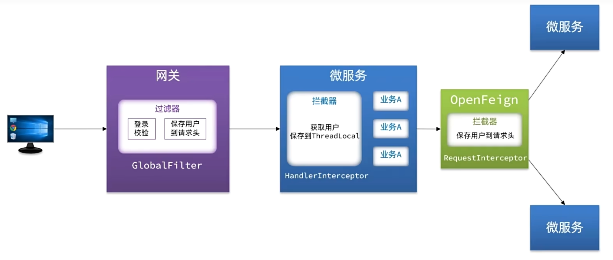
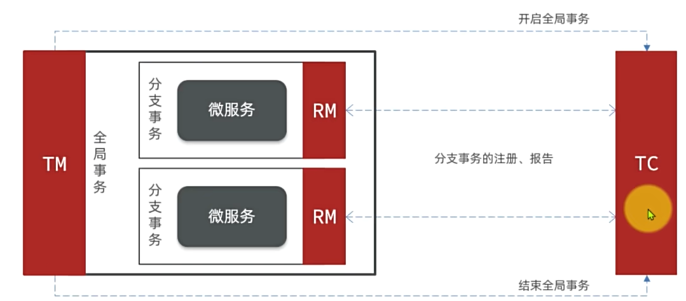
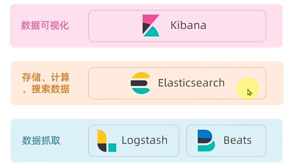

[TOC]

# 微服务学习笔记

&emsp;微服务是一种软件架构风格，它是以专注于单一职责的很多小型项目为基础，组合出复杂的大型应用。

## MyBatisPlus

&emsp;MyBatisPlus官方提供了starter，其中集成了MyBatis和MyBatisPlus的所有功能，并且实现了自动装配效果。

### 使用MyBatisPlus基本步骤：

1. 引入MyBatisPlus依赖，代替MyBatis依赖
2. 定义Mapper接口并继承BaseMapper（extends BaseMapper\<User>指定泛型）

### 常见注解

&emsp;MyBatisPlus通过扫描实体类，并基于反射获取实体类信息作为数据库信息。

### Q&A

#### MybatisPlus是如何获取实现CRUD的数据库表信息的？

- 默认以类名驼峰转下划线作为表名
- 默认把名为id的字段作为主键
- 默认把变量名驼峰转下划线作为表的字段名

#### MyBatisPlus的常用注解有哪些？

- @TableName：指定表名称及全局配置
- @TableId：指定id字段及相关配置
- @TableField：指定普通字段及相关配置

#### IdType的常见类型有哪些？

&emsp;AUTO、ASSIGN_ID、INPUT

#### 使用@TableField的常见场景是？

- 成员变量名与数据库字段名不一致
- 成员变量名以is开头，且是布尔值（因为扫描会自动去除is，@TableField（“is_married”））
- 成员变量名与数据库关键字冲突（@TableField("\`order`")）
- 成员变量不是数据库字段（@TableField(exist = false)）

#### MybatisPlus使用的基本流程是什么？

1. 引入起步依赖
2. 自定义Mapper基础BaseMapper
3. 在实体类上添加注解声明 表信息
4. 在application.yml中根据需要添加配置

### 核心功能

#### 条件构造器

&emsp;MyBatisPlus支持各种复杂的where条件，可以满足日常开发的所有需求。

##### 用法：

- QueryWrapper和LambdaQueryWrapper通常用来构建select、delete、update的where条件部分
- UpdateWrapper和LambdaUpdateWrapper通常只有在set语句比较特殊才使用
- 尽量使用LambdaQueryWrapper和LambdaUpdateWrapper，避免硬编码 （即写死）。

#### 自定义SQL

&emsp;我们可以利用MyBatisPlus的Wrapper来构建复杂的Where条件，然后自己定义SQL语句中剩下的部分。

&emsp;因为用MyBatisPlus来写Where条件很简单，不想动态SQL那么繁琐，而且企业不让把数据库操作写在Server层，应该在Mapper层，所以一般就是复杂的Where条件先用MyBatisPlus构造好，再去调用Mapper层接口拼接完SQL语句进行数据库操作。

&emsp;在Mapper方法参数中用Param注解声明Wrapper变量名称，必须是ew（返回值 方法名(@Param("ew") LambdaQueryWrapper\<User> wrapper, @Param...)）

&emsp;自定义SQL语句中，用${ew.customSqlSegment}进行拼接

#### IService接口

&emsp;MP（MyBatisPlus）的Service接口使用流程：

- 自定义Service接口继承IService接口
- 自定义Service实现类，实现自定义接口并继承ServiceImpl类（继承时泛型需执行Mapper跟实体类）

#### IService批量新增

- 普通for循环插入：速度极差，每条操作都是一次网络请求跟一条SQL插入语句（n次网络请求+m次SQL语句插入）
- IService的批量插入：基于预编译批处理，性能不错，只需要一次网络请求就可以发送多条SQL语句（1次网络请求+m次SQL语句插入）
- 配置jdbc参数，开启rewriteBatchedStatements=true参数，多条插入SQL语句会重写成一条语句，只需一次网络请求跟一条SQL语句，性能最好（1次网络请求+1次SQL语句插入）

### 扩展功能

#### 代码生成

&emsp;代码生成插件（MyBatisPlus（二次元图片那个）），可根据数据库自动生成Controller、Server、Mapper，entry各种代码

#### DB静态工具

&emsp;有时会出现多个Service之间会相互调用，如果采用AutoWire自动注入的方式，相互注入就会出现循环依赖，静态工具的提供的方法跟Service差不多，不过因为是静态的，在调用的时候需要指定字节码（.class）

&emsp;一个用户有多个地址，先对用户进行分组，分组完得到Map\<userId, list\<address>>，这样的话插入数据的时候，插入用户，再去设置用户的地址。比插入用户，再从address中遍历所有属于该用户的地址要高效的多，不用每个用户都去遍历地址，而是在一开始就先把地址跟用户Map好。

### 逻辑删除

&emsp;逻辑删除就是基于代码逻辑模拟删除效果，但并不会真正删除数据。思路如下：

- 在表中添加一个字段标记数据是否被删除
- 当删除数据是把标记置为1/true
- 查询时只查询标记为0/false的数据

&emsp;MybatisPlus提供了逻辑删除功能，无需改变方法的调用方式，而是在底层帮我们自动修改CRUD的语句。我们要做的就是在application.yaml文件中配置逻辑删除的字段名称和值即可：

```yaml
mybatis-plus:
	global-config:
		db-config:
			logic-delete-field: flag #全局逻辑删除的实体字段名，字段类型可以是boolean、integer
			logic-delete-value: 1 # 逻辑已删除值（默认为1）
			logic-not-delete-value: 0 #逻辑未删除值（默认为0）
```

#### 优点&缺点

- 优点：数据保留了，对后续的用户数据分析、画像、留证有重要意义
- 缺点：
- - 会导致数据库表垃圾数据越来越多，影响查询效率
  - SQL中全都需要对逻辑删除字段做判断，影响查询效率

因此，不太推荐采用逻辑删除功能，如果数据不能删除，可以采用**把数据迁移到其他表**的办法。

### 枚举处理器

如何实现PO类中的枚举类型变量与数据库字段的转换？

1. 给枚举中的数据库对应value值添加@EnumValue注解
2. 在配置文件中配置统一的枚举处理器，实现类型转换

```yaml
mybatis-plus:
	configuration:
		default-enum-type-handler: com.baomidou.mybatisplus.core.handlers.MybatisEnumTypeHandler
```

3. 在返回前端数据时，给枚举变量的某个属性加上@JsonValue，这样返回给前端的就不再是枚举对象的名称，而是加了注解的值

### Json处理器

&emsp;数据库中有Json类型的字段，在实体类中，需要定义一个对象来接收Json，在该对象上面添加注解`@TableField(typeHandler = JacksonTypeHandler.class)`并且在实体类上面添加注解`@TableName(autoResultMap = true)`，就可以实现数据库的Json字段自动转换为实体类中的对象各种数据。

## Docker

&emsp;快速构建、运行、管理应用的工具。

### 镜像和容器

&emsp;当我们利用Docker安装应用时，Docker会自动搜索并下载应用镜像（image）。镜像不仅包含应用本身，还包含应用运行所需要的环境、配置、系统函数库。Docker会在运行镜像时创建一个隔离环境，称为容器（container）。

&emsp;**镜像仓库：**存储和管理镜像的平台，Docker官方维护了一个公共仓库：Docker Hub。

### 部署MySQL

&emsp;先停掉虚拟机中的MySQL，确保虚拟机已经安装Docker，且网络开通的情况下，执行下面命令即可安装MySQL：

```shell
docker run -d \
	--name mysql \
	-p 3306:3306 \
	-e TZ=Asia/Shanghai \
	-e MYSQL_ROOT_PASSWORD=123 \
	mysql
```

- **docker run：**创建并运行一个容器，**-d**是让容器在后台运行
- **--name mysql：**给容器起个名字，必须唯一
- **-p 3306:3306：**设置端口映射（宿主机端口映射到容器内端口，因为容器是隔离环境，不同容器可以相同端口，也有自己的ip，而外部无法直接访问容器，需要访问宿主机，由宿主机映射相应的容器）
- **-e KEY=VALUE：**设置环境变量
- **mysql：**指定运行的镜像的名字（一般是Repository:TAG）

#### 镜像命名规范

&emsp;镜像名称一般分两部分组成：**[repository]:[tag]**。

- 其中repository就是镜像名称
- tag是镜像的版本

&emsp;在没有指定tag时，默认是latest，代表最新版本的镜像

### 常见命令

- docker pull：从镜像仓库中拉取到本地镜像
- docker push：将本地镜像推送到镜像仓库
- docker build：编写自定义镜像，通过dockerfile构建本地镜像
- docker save：将本地镜像保存成文件.tar
- docker load：加载文件到本地镜像
- docker images：查看本地所以镜像
- docker rmi：删除本地镜像
- docker run：**创建并**运行本地镜像（本地镜像没有会去镜像仓库拉取）
- docker stop：停止容器内的进程（**容器还在**）
- docker start：开启停止的容器、
- docker ps：查看容器进程状态（ps：process state）
- docker exec：连接容器在容器内部执行命令

### 数据卷

&emsp;**数据卷（volume）**是一个**虚拟**目录，是容器内目录与宿主机目录之间映射的桥梁。方便操作容器内文件，或者迁移容器产生的数据。

#### 如何挂载数据卷？

- **docker run** 创建容器时，利用 **-v 数据卷名:容器内目录** 或 **-v 本地目录:容器内目录** 可以完成本地目录挂载
- 容器创建时，如果发现挂载的数据卷不存在时，会自动创建（匿名数据卷：目录层深，名字太长，不便于后续数据存储与迁移）
- 本地目录必须以“/"或”./“开头，如果直接以名称开头，会被识别为数据卷而非本地目录
- `-v mysql:/var/lib/mysql`会被识别为一个数据卷叫mysql
- `-v ./mysql:/var/lib/mysql`会被识别为当前目录下的mysql目录

#### 数据卷命令

- docker volume create：创建数据卷
- docker volume ls：查看所有数据卷
- docker volume rm：删除指定数据卷
- docker volume inspect：查看某个数据卷的详情
- docker volume prune：删除未使用的数据卷

### 自定义镜像

&emsp;镜像就是包含了应用程序、程序运行的系统函数库、运行配置等文件的文件包。构建镜像的过程其实就是把上述文件打包的过程。

#### 镜像结构

- 基础镜像（BaseImage）：应用依赖的系统函数库、环境、配置、文件等
- 层（Layer）：添加安装包、依赖、配置等，每次操作都形成新的一层
- 入口（EntryPoint）：镜像运行入口，一般是程序启动的脚本和参数

#### Dockerfile

&emsp;Dockerfile就是一个文本文件，其中包含一个个的**指令（Instruction）**，用指令来说明要执行什么操作来构建镜像。将来Docker可以根据Dockerfile帮我们构建镜像。常见指令如下：

|    指令    |                     说明                     |                             示例                             |
| :--------: | :------------------------------------------: | :----------------------------------------------------------: |
|    FROM    |                 指定基础镜像                 |                        FROM centos:6                         |
|    ENV     |        设置环境变量，可在后面指令使用        |                        ENV key value                         |
|    COPY    |         拷贝本地文件到镜像的指定目录         |                   COPY ./jrell.tar.gz /tmp                   |
|    RUN     |  执行Linux的shell命令，一般是安装过程的命令  | RUN tar -zxvf /tmp/jrell.tar.gz <br />&& EXPORTS path=/tmp/jrell:$path |
|   EXPOSE   | 指定容器运行时监听的端口，是给镜像使用者看的 |                         EXPOSE 8080                          |
| ENTRYPOINT |     镜像中应用的启动命令，容器运行时调用     |                 ENTRYPOINT java -jar xx.jar                  |

&emsp;我们可以基于Ubuntu基础镜像，利用Dockerfile描述镜像结构，也可以直接基于JDK为基础镜像，省略前面的步骤。

&emsp;当编写好了Dockerfile，可以利用下面命令来构建镜像：

```shell
docker build -t 镜像名 Dockerfile目录
```

eg：`docker build -t myImage:1.0 .`

- **-t**：是给镜像起名，格式依然是repository:tag的格式，不指定tag时，默认为latest
- **.** ：是指定Dockerfile所在目录，如果就在当前目录，则指定为“.”

### 容器网络互联

&emsp;默认情况下，所有容器都是以bridge方法连接到Docker的一个虚拟网桥上，这可能会导致同一个软件每次创建容器时分配的ip不一致。

&emsp;加入自定义网络的容器才可以通过容器名互相访问，Docker的网络操作命令如下：

|           命令            |           说明           |
| :-----------------------: | :----------------------: |
|   docker network create   |       创建一个网络       |
|     docker network ls     |       查看所有网络       |
|     docker network rm     |       删除指定网络       |
|   docker network prune    |     清楚未使用的网络     |
|  docker network connect   | 使指定容器连接加入某网络 |
| docker network disconnect | 使指定容器连接离开某网络 |
|  docker network inspect   |     查看网络详细信息     |

### 部署项目

#### 部署后端

- 首先把Java应用打包成jar包（通过maven的package），上传到虚拟机
- 上传准备好的Dockerfile
- 执行docker run命令构建并启动

#### 部署前端

- 准备好配置文件（nginx.conf）和静态资源
- 创建容器挂载目录并启动

Java应用要跟mysql互连，Java、mysql、nginx三个容器要在同一个网络，三者通过容器名互连。

### DockerCompose

&emsp;Docker Compose通过一个单独的**docker-compose.yml**模板文件（YAML格式）来定义一组相关联的应用容器，帮助我们实现多个相互关联的Docker容器的快速部署。

&emsp;docker compose的命令格式如下：
`docker compose [OPTIONS] [COMMAND]`

|   类型   | 参数或指令 |             说明             |
| :------: | :--------: | :--------------------------: |
| Options  |     -f     | 指定compose文件的路径和名称  |
| Options  |     -p     |       指定project名称        |
| Commands |     up     |  创建并启动所有service容器   |
| Commands |    down    | 停止并溢出所有容器、**网络** |
| Commands |     ps     |      列出所有启动的容器      |
| Commands |    logs    |      查看指定容器的日志      |
| Commands |    stop    |           停止容器           |
| Commands |   start    |           启动容器           |
| Commands |  restart   |           重启容器           |
| Commands |    top     |        查看运行的进程        |
| Commands |    exec    | 在指定的运行中容器中执行命令 |

## 认识微服务

&emsp;ssh客户端推荐**MobarXterm**，数据库管理工具使用**HeidiSQL**。

### 单体架构

&emsp;**单体架构：**将业务的所有功能集中在一个项目中开发，打成一个包部署。

**优点：**

- 架构简单
- 部署成本低

**缺点：**

- 团队协作成本高
- 系统发布效率低
- 系统可用性差

总结：单体架构适合开发功能相对简单，规模较小的项目。

### 微服务

&emsp;微服务架构，是服务化思想指导下的一套最佳实践架构方案。服务化，就是把单体架构中的功能模块拆分为多个独立项目。

拆分要求：

- 粒度小
- 团队自治
- 服务自治

### SpringCloud

&emsp;SpringCloud是目前国内使用最广泛的微服务框架，官网地址：https://spring.io/projects/spring-cloud。

&emsp;SpringCloud集成了各种微服务功能组件，并基于SpringBoot实现了这些组件的自动装配，从而提供了良好的开箱即用体验：

|    微服务功能    |           组件           |
| :--------------: | :----------------------: |
|   服务注册发现   |  Eureka、Nacos、Consul   |
|   服务远程调用   |     OpenFeign、Dubbo     |
|   服务链路监控   |      Zipkin、Sleuth      |
|   统一配置管理   | SpringCloudConfig、Nacos |
|   统一网关路由   | SpringCloudGateway、Zuul |
| 流控、降级、保护 |     Hystix、Sentinel     |

## 微服务拆分

### 什么时候拆分？

- **创业型项目：**先采用单体架构，快速开发，快速试错。随着规模扩大，逐渐拆分。
- **确定的大型项目：**资金充足，目标明确，可以直接选择微服务架构，避免后续拆分的麻烦。

### 怎么拆分？

从拆分目标来说，要做到：

- **高内聚：**每个微服务的职责要尽量单一，包含的业务相互关联度高、完整度高。
- **低耦合：**每个微服务的功能要相对独立，尽量减少对其他微服务的依赖。

从拆分方式来说，一般包含两种方式：

- **纵向拆分：**按照业务模块来拆分
- **横向拆分：**抽取公共服务，提高复用性

### 拆分服务

工程结构有两种：

- 独立Project
- Maven聚合

### 远程调用

- 拆分后，某些数据在不同服务，无法直接调用本地方法查询数据
- 利用RestTemplate发送Http请求，实现远程调用，具体步骤：
- 1. 注入RestTemplate到Spring容器
  2. 发起远程调用

## 服务治理

### Q&A

#### 远程调用存在的问题：

- 服务的调用者不知道调用地址
- 就算知道了地址，那要去访问集群中的那一个呢？
- url写死了，结果这个服务挂了，没办法切到其他服务
- 运行过程中有新的服务启动了，无法感知新服务的地址

#### 服务治理的三个角色分别是什么？

- 服务提供者：暴露服务接口，供其他服务调用
- 服务消费者：调用其他服务提供的接口
- 注册中心：记录并监控微服务各实例状态，推送服务变更信息

#### 消费者如何知道提供者的地址？

&emsp;服务提供者会在启动时注册自己信息到注册中心，消费者可以从注册中心订阅和拉取服务信息

#### 消费者如何得知服务状态变更？

&emsp;服务提供者通过心跳机制向注册中心报告自己的健康状态，当心跳异常时注册中心会将异常服务删除，并通知订阅了该服务的消费者

#### 当提供者有多个实例时，消费者该选择哪一个？

&emsp;消费者可以通过负载均衡算法，从多个实例中选择一个。

### 服务注册

&emsp;服务提供者会在启动时注册自己信息到注册中心。

#### Nacos注册中心

&emsp;Nacos是目前国内企业中占比最多的注册中心组件。它是阿里巴巴的产品，目前已经加入SpringCloudAlibaba中。

#### 服务注册的步骤

1. 引入nacos discovery依赖
2. 配置Nacos地址

### 服务发现

&emsp;消费者需要连接nacos以拉取和订阅服务。

#### 服务发现的步骤：

1. 引入nacos discovery依赖
2. 配置Nacos地址
3. 服务发现（springframework提供的DiscoveryClient对象，调用getInstances方法）

## OpenFeign

&emsp;OpenFeign是一个声明式的http客户端，是SpringCloud在Eureka公司开源的Feign基础上改造而来。官方地址：https://github.com/OpenFeign/feign，其作用就是基于**SpringMVC**的常见注解，帮我们优雅的实现http请求的发送。

### 连接池

&emsp;OpenFeign对Http请求做了优雅的伪装，不过其底层发起http请求，依赖于其他框架。这些框架可以自己选择，包括一下三种：

- **HttpURLConnection：**默认实现，不支持连接池（**每次都要手动建立连接，利用InputStream流的方式做读写，效率是比较慢的**）
- **Apache HttpClient：**支持连接池
- **OKHttp：**支持连接池

具体源码可以参考**FeignBlockingLoadBalancerClient**类中的**delegate**成员变量。

### 日志

&emsp;OpenFeign只会在FeignClient所在包的日志级别为DEBUG时，才会输出日志。而且其日志级别有4级：

- NONE：不会记录任何日志信息，这是默认值。
- BASIC：仅记录请求的方法，URL以及响应状态码和执行时间
- HEADERS：在BASIC的基础上，额外记录了请求和响应的头信息
- FULL：记录所有请求和响应的明细，包括头信息、请求体、元数据。

由于Feign默认的日志级别是NONE，所有默认我们看不到请求日志。

&emsp;要自定义日志级别需要声明一个类型为Logger.Level的Bean，在其中定义日志级别，但此时这个Bean并未生效，要想配置某个FeignClient的日志，可以在@FeignClient注解中声明；如果想要全局配置，让所以FeignClient都按照这个日志配置，则需要在@EnableFeignClients注解中声明。

### Q&A

#### 如何利用OpenFeign实现远程调用？

- 引入OpenFeign和SpringCloudLoadBalancer依赖
- 利用@EnableFeignClients注解开启OpenFeign功能
- 编写FeignClient

#### 如何配置OpenFeign的连接池？

- 引入http客户端依赖，例如OKHttp、HttpClient
- 配置yaml文件，打开OpenFeign连接池开关

#### OpenFeign使用的最佳实践方式是什么？

- 由服务提供者编写独立module，将FeignClient及DTO抽取

#### 如何配置OpenFeign输出日志的级别？

- 声明类型为Logger.Level的Bean
- 在@FeignClient或EnableFeignClients注解上使用

## 网关

&emsp;**网关：**就是网络的关口，负责请求的路由、转发和身份校验。

在SpringCloud中网关的实现包括两种：

1. Spring Cloud Gateway
   - Spring官方出品
   - 基于WebFlux**响应式**编程
   - 无需调优即可获得优异性能
2. NetFilx zuul
   - NetFlix出品
   - 基于Servlet的阻塞式编程
   - 需要调优才能获得与SpringCloudGateway类似的性能

### 网关路由

**使用流程：**

- 创建新模块
- 引入网关依赖
- 编写启动类
- 配置路由规则

```yaml
spring:
	cloud:
		gateway:
			routes:
				- id: item #路由规则id，自定义，唯一
				  uri: lb://item-service #路由目标微服务，lb代表负载均衡
				  predicates: #路由断言，判断请求是否符合规则，符合则路由到目标
				  	- Path=/items/** #以请求路径做判断，以/items开头则符合
				- id: xx
				  uri: lb://xx-service
				  predicates:
				  	- Path=/xx/**
```

### 路由属性

&emsp;**网关路由**对应的Java类型是RouteDefinition，其中常见的属性有：

- id：路由唯一标示
- uri：路由目标地址
- predicates：路由断言，判断请求是否符合当前路由
- filters：路由过滤器，对请求或响应做特殊处理

### 网关登录校验

#### 自定义过滤器

&emsp;网关过滤器有两种，分别是：

- GatewayFilter：路由过滤器，作用与任意指定的路由；默认不生效，要配置到路由后生效。
- GlobalFilter：全局过滤器，作用范围是所有路由；声明后自动生效。

两种过滤器的过滤方法签名完全一致。

#### OpenFeign传递用户信息

&emsp;微服务项目中的很多业务要多个微服务共同合作完成，而这个过程中也需要传递用户登录信息，OpenFeign中提供了一个拦截器接口，所有由OpenFeign发起的请求都会先调用拦截器处理请求：其中的RequestTemplate类中提供了一些方法可以让我们修改请求头

### 微服务登录解决方案

|  |
| :------------------------------------------------: |

## 配置管理

- 微服务重复配置过多，维护成本高
- 业务配置经常变动，每次修改都要重启服务
- 网关路由配置写死，如果变更要重启网关

### 共享配置

1. 添加配置到Nacos

   添加一些共享配置到Nacos中，包括：Jdbc、MyBatisPlus、日志、Swagger、OpenFeign等配置

2. 拉取共享配置

   基于NacosConfig拉取共享配置代替微服务的本地配置

|  |
| :--------------------------------------------: |

### 配置热更新

&emsp;配置热更新：当修改配置文件中的配置时，微服务无需重启即可使配置生效。

前提条件：

1. nacos中要有一个与微服务名有关的配置文件
2. 微服务中要以特定方式读取需要热更新的配置属性

### 动态路由

&emsp;要实现动态路由首先要将路由配置保存到Nacos，当Nacos中的路由配置变更时，推送最新配置到网关，实时更新网关中的路由信息。

需要完成的两件事情：

1. 监听Nacos配置变更的信息
2. 当配置变更时，将最新的路由信息更新到网关路由表

## 微服务保护和分布式事务

### 雪崩问题

&emsp;微服务调用链路中的某个服务故障，引起整个链路中的所有微服务都不可用，这就是雪崩。

#### Q&A

##### 雪崩问题产生的原因是什么？

- 微服务相互调用，服务提供者出现故障或阻塞
- 服务调用者没有做好异常处理，导致自身故障
- 调用链中的所有服务级联失败，导致整个集群故障

##### 解决问题的思路有哪些？

- 尽量避免服务出现故障或阻塞
- - 保证代码的健壮性
  - 保证网络畅通
  - 能应对较高的并发请求
- 服务调用者做好远程调用异常的后背方案，避免故障扩散

##### 解决方案（服务保护方案）

- **请求限流：**限制访问微服务的请求的并发量，避免服务因流量激增出现故障。
- **线程隔离：**也叫做舱壁模式，模拟船舱隔板的防水原理。通过限定每个业务能使用的线程数量而将故障业务隔离，避免故障扩散。
- **服务熔断：**由**断路器**统计请求的异常比例或慢调用比例，如果超出阈值则会熔断该业务，则拦截该接口的请求。熔断期间，所有请求快速失败，全都走fallback逻辑
- **失败处理：**定义fallback逻辑，让业务失败时不再抛出异常，而是返回默认数据或友好提示。

### 服务保护技术-Sentinel

|          |                    Sentinel                    |           Hystrix            |
| :------: | :--------------------------------------------: | :--------------------------: |
| 线程隔离 |                   信号量隔离                   |    线程池隔离/信号量隔离     |
| 熔断策略 |            基于慢调用比例或异常比例            |         基于异常比率         |
|   限流   |             基于QPS，支持流量整形              |          有限的支持          |
| Fallback |                      支持                      |             支持             |
|  控制台  | 开箱即用，可配置规则、查看秒级监控、机器发现等 |            不完善            |
| 配置方式 |             基于控制台，重启后失效             | 基于注解或配置文件，永久生效 |

#### 初识Sentinel

&emsp;Sentinel是阿里巴巴开源的一款微服务流量控制组件。官网地址：https://sentinelguard.io/zh-cn/index.html

#### 簇点链路

&emsp;**簇点链路**，就是单机调用链路。是一次请求进入服务后经过的每一个被Sentinel监控的资源链。默认Sentinel会监控SpringMVC的每一个Endpoint（http接口）。限流、熔断等都是针对簇点链路中的**资源**设置的。而资源名默认就是接口的请求路径。

&emsp;Restful风格的API请求路劲一般都相同，这会导致簇点资源名称重复。因此我们要修改配置，把**请求方式+请求路径**作为簇点资源名称。

#### 测试工具-JMeter-1000线程并发访问

#### 服务熔断逻辑

&emsp;熔断降级是解决雪崩问题的重要手段。思路是由断路器统计服务调用的异常比例、慢请求比例，如果超出阈值则会熔断该服务。即拦截访问该服务的一切请求；而当服务恢复时，断路器会放行访问该服务的请求。

|  |
| :--------------------------------: |

### 分布式事务

&emsp;在分布式系统中，如果一个业务需要多个服务合作完成，而且每一个服务都有事务，多个事务必须同时成功或失败，这样的事务就是分布式事务。其中的每个服务的事务就是一个分支事务。整个业务称为全局事务。

|  |
| :----------------------------------------------------: |

#### 解决思路

&emsp;解决分布式事务，各个子事务之间必须能感知到彼此的事务状态，才能保证状态一致。

#### Seata架构

&emsp;Seata事务管理中有三个重要的角色：

- **TC(Transaction Coordinator)-事务协调者：**维护全局和分支事务的状态，协调全局事务提交或回滚。
- **TM(Transaction Manager)-事务管理器：**定义全局事务的范围、开始全局事务、提交或回滚全局事务。
- **RM(Resource Manage)-资源管理器：**管理分支事务，与TC交谈以注册分支事务和报告分支事务的状态。

|  |
| :------------------------------: |

#### XA模式

&emsp;XA规范是X/Open组织定义的分布式事务处理（DTP，Distributed Transaction Processing）标准，XA规范描述了全局的TM与局部RM之间的接口，几乎所有主流的关系型数据库都对XA规范提供了支持。Seata的XA模式如下：

|  |
| :--------------------------------------: |

- **一阶段的工作：**

- 1. RM注册分支事务到TC
  2. RM执行分支业务sql但不提交
  3. RM报告执行状态TC

- **二阶段的工作：**

- 1. TC检查各分支事务的执行状态

     如果都成功，通知所有RM提交事务

     如果都失败，通知所有RM回滚事务

  2. RM接受TC执行，提交或回滚事务

#### Q&A

##### XA模式的优点是什么？

- 事务的强一致性，满足ACID原则
- 常用数据库都支持，实现简单，并且没有代码侵入

##### XA模式的缺点是什么？

- 因为一阶段需要锁定数据库资源，等待二阶段结束才释放，性能较差
- 依赖关系型数据库实现事务

#### AT模式

&emsp;Seata主推的是AT模式，AT模式同样是分阶段提交 的事务模型，不过弥补了XA模型中资源锁定周期过长的缺陷。

|  |
| :------------------------: |

- **阶段一RM的工作**
- - 注册分支事务
  - 记录undo-log（**数据快照**）
  - 执行业务sql并提交
  - 报告事务状态
- **阶段二提交时RM的工作：**
- 删除undo-log即可
- 阶段二回滚时RM的工作：
- 根据undo-log恢复数据到更新前

#### Q&A

简述AT模式与XA模式最大的区别是什么？

- XA模式一阶段不提交事务，锁定资源；AT模式一阶段直接提交，不锁定资源。
- XA模式依赖数据库机制实现回滚；AT模式利用数据快照实现数据回滚。
- XA模式强一致；AT模式最终一致

## MQ

### 同步调用

#### Q&A

##### 同步调用的优势是什么？

- 时效性强，等待到结果后才返回。

##### 同步调用的问题是什么？

- 拓展性差
- 性能下降
- 级联失败问题（雪崩）

### 异步调用

&emsp;异步调用通常是基于消息通知的方式，包含三个角色：

- 消息发送者：投递消息的人，就是原来的**调用者**
- 消息接受者：接受和处理消息的人，就是原来的**服务提供者**
- 消息代理：管理、暂存、转发消息，可以理解成微信服务器

&emsp;支付服务不在同步调用业务关联度低的服务，而是发送消息通知到Broker。

|  |
| :----------------------------: |

#### Q&A

##### 异步调用的优势是什么？

- 耦合度低，扩展性强
- 异步调用，无需等待，性能好
- 故障隔离，下游服务故障不影响上游业务
- 缓存消息，流量削峰填谷

##### 异步调用的问题是什么？

- 不能立刻得到调用结果，时效性差
- 不确定下游业务执行是否成功
- 业务安全依赖于Broker的可靠性

### MQ技术选型

&emsp;MQ（MessageQueue），中文是消息队列，字面来看就是存放消息的队列。也就是异步调用中的Broker。

|            |        RabbitMQ        |                ActiveMQ                |  RockerMQ  |   Kafka    |
| :--------: | :--------------------: | :------------------------------------: | :--------: | :--------: |
| 公司/社区  |         Rabbit         |                 Apache                 |    阿里    |   Apache   |
|  开发语言  |         Erlang         |                  Java                  |    Java    | Scala&Java |
|  协议支持  | AMQP, XMPP, SMTP, STOP | OpenWire, STOMP,<br />REST, XMPP, AMQP | 自定义协议 | 自定义协议 |
|   可用性   |           高           |                  一般                  |     高     |     高     |
| 单机吞吐量 |          一般          |                   差                   |     高     |   非常高   |
|  消息延迟  |         微妙级         |                 毫秒级                 |   毫秒级   |  毫秒以内  |
| 消息可靠性 |           高           |                  一般                  |     高     |    一般    |

### RabbitMQ基本介绍

&emsp;RabbitMQ的整体架构及核心概念：

- virtual-host：虚拟主机，起到了数据隔离的作用
- publisher：消息发送者
- consumer：消息的消费者
- queue：队列，存储消息
- exchange：交换机，负责路由消息

|  |
| :--------------------------------------------: |

### 消息发送的注意事项有哪些？

- 交换机只能路由消息，无法存储消息
- 交换机只会路由消息给与其绑定的队列，因为队列必须与交换机绑定

### 快速入门

&emsp;SpringAmqp的官方地址：https://spring.io/projects/spring-amqp

#### AMQP

&emsp;AMQP（**A**dvanced **M**essage **Q**ueuing **P**rotocol），是用于在应用程序之间传递业务消息的开放标准。该协议与语言和平台无关，更符合微服务中独立性的要求。

&emsp;Spring AMQP是基于AMQP协议定义的一套API规范，提供了模板来发送和接受消息。包含两部分，其中spring-amqp是基础抽象，spring-rabbit是底层的默认实现。

### Java客户端

#### SpringAMQP如何收发消息？

1. 引入spring-boot-starter-amqp依赖
2. 配置RabbitMQ服务端信息
3. 利用RabbitTemplate发送消息
4. 利用@RabbitListener注解声明要监听的队列，监听消息

#### WorkQueue消费者消息推送限制

&emsp;默认情况下，RabbitMQ的会将消息依次轮训投递给绑定在队列上的每一个消费者。但这并没有考虑到消费者是否已经处理完消息，可能出现消息堆积。

&emsp;因此我们需要修改application.yml，设置preFetch值为1，确保同一时刻最多投递给消费者1条消息：

```yaml
spring:
  rabbitmq:
    listener:
      simple:
        prefetch: 1 #每次只能获取一条消息，处理完成才能获取下一个消息
```

Work模型的使用：

- 多个消费者绑定到一个队列，可以加快消息处理速度
- 同一条消息只会被一个消费者处理
- 通过设置prefetch来控制消费者预取的消息数量，处理完一条再处理下一条，实现能者多劳

#### 交换机

&emsp;交换机的作用主要是**接收**发送者发送的消息，并将消息**路由**到与其绑定的队列。

&emsp;常见的交换机的类型有以下三种：

- Fanout：广播
- Direct：定向
- Topic：话题

#### Fanout交换机

&emsp;Fanout Exchange 会将接收到的消息路由到**每一个**跟其绑定的queue，所以也叫广播模式。

##### 交换机的作用是什么？

- 接收publisher发送的消息
- 将消息按照规则路由到与之绑定的队列
- FanoutExchange的会将消息路由到每个绑定的队列

#### Direct交换机

&emsp;Direct Exchange 会将接受到的消息根据规则路由到指定的Queue，因此称为**定向**路由。

- 每一个Queue都与Exchange设置一个BindingKey
- 发布者发送消息时，指定消息的RoutingKey
- Exchange将消息路由到BindingKey与消息RoutingKey一致的队列

##### 描述下Direct交换机与Fanout交换机的差异

- Fanout交换机将消息路由给每一个与之绑定的队列
- Direct交换机根据RoutingKey判断路由给哪个队列
- 如果多个队列具有**相同RoutingKey**，则与Fanout功能类似

#### Topic交换机

&emsp;TopicExchange也是基于RoutingKey做消息路由，但是RoutingKey通常是多个单词的组合，并且以 **.** 分割。

&emsp;Queue与Exchange指定BindingKey时可以使用通配符：

- #：代指0个或多个单词
- *：代指一个单词

##### 描述下Topic交换机相比Direct交换机的差异

- Topic的RoutingKey和BindingKey可以是多个单词，以 **.** 分割
- Topic交换机与队列绑定时的BindingKey可以指定通配符
- #：代指0个或多个单词
- *：代指1个单词

#### 基于Bean声明队列和交换机

&emsp;SpringAMQP提供了几个类，用来声明队列、交换机及其绑定关系：

- Queue：用于声明队列，可以用工厂类QueueBuilder构建
- Exchange：用于声明交换机，可以用工厂类ExchangeBuilder构建
- Binding：用于声明队列和交换机的绑定关系，可以用工厂类BindingBuilder构建

#### 基于注解声明队列和交换机

&emsp;SpringAMQP还提供了基于@RabbitListener注解来声明队列和交换机的方式：

```java
@RabbitLlistener(bindings = @QueueBinding(
	value = @Queue(name = "direct.queue1"),
    exchange = @Exchange(name = "xxxx.direct", type = ExchangeTypes.DIRECT),
	key = {"red", "blue"}
))
public void listenDirectQueue1(String msg){
    System.out.println("消费者1接收到Direct消息：["+msg+"]");
}
```

#### 消息转换器

&emsp;Spring的对消息对象的处理是由org.springframework.amqp.support.converter.MessageConverter来处理的。而默认实现的是SimpleMessageConverter，是基于JDK的ObjectOutputStream完成序列化。

&emsp;存在下列问题：

- JDK的序列化有安全风险（做反序列化的时候容易被代码注入）
- JDK序列化的消息太大
- JDK序列化的消息可读性差

&emsp;建议采用JSON序列化代替默认的JDK序列化，要做两件事情：

1. 在Publisher和consumer中都要引入jackson依赖：<br>

   ```yaml
   <dependency>
   	<groupId>com.fasterxml.jackson.core</groupId>
   	<artifactId>jackson-databind</artifactId>
   </dependency>
   ```

2. 在Publisher和consumer中都要配置MessageConverter：<br>

   ```java
   @Bean
   public MessageConverter messageConverter(){
   	return new Jackson2JsonMessageConverter();
   }
   ```

### 发送者可靠性

#### 发送者重连

&emsp;有的时候由于网络波动，可能会出现发送者连接MQ失败的情况。通过配置我们可以开启连接失败的重连机制。

##### 注意-阻塞式重连：

&emsp;当网络不稳定的时候，利用重试机制可以有效提高消息发送的成功率。不过SpringAMQP提供的重试机制是**阻塞式**的重试，也就是说多次重试等待的过程中，当前线程是被阻塞的，会影响业务性能。

&emsp;如果对于业务性能有要求，建议**禁用**重试机制。如果一定要使用，请合理配置等待时长和重试次数，当然也可以考虑使用**异步**线程来执行发送消息的代码。

#### 发送者确认

&emsp;SpringAMQP提供了Publisher Confirm和Publisher Return两种确认机制。开启确认机制后，当发送者发送消息给MQ后，MQ会返回确认结果给发送者。返回的结果有以下几种情况：

- 消息投递到MQ，但是路由失败。此时会通过PublisherReturn返回路由异常原因，然后返回**ACK**，告知投递成功
- 临时消息投递到MQ，并且入队成功，返回**ACK**，告知投递成功
- 持久消息投递到MQ，并且入队完成**持久化**，返回**ACK**，告知投递成功
- 其他情况都会返回NACK，告知投递失败

|  |
| :--------------------------------: |

##### SpringAMQP实现发送者确认

1. 在Publisher这个微服务的application.yml中添加配置：<br>

   ```yaml
   spring:
     rabbitmq:
       publisher-confirm-type: correlated #开启Publisher Confirm机制，并且设置Confirm类型
       publisher-returns: true #开启Publisher Return机制
   ```

   配置说明：

   - 这里publisher-confirm-type有三种模式可选：
   - - none：关闭confirm机制
     - simple：同步阻塞等待MQ的回执消息
     - correlated：MQ异步回调方式返回回执消息

2. 每个RabbitTemplate只能配置一个ReturnCallback，因此需要在项目启动过程中配置：init方法添加@PostConstruct

3. 发送消息，指定消息ID、消息ConfirmCallback

### MQ可靠性

&emsp;在默认情况下，RabbitMQ会将接收到的信息保存在内存中以降低消息收发的延迟。这样会导致两个问题：

- 一旦MQ宕机，内存中的消息会丢失
- 内存空间有限，当消费者故障或处理过慢时，会导致消息挤压，引发MQ阻塞

|  |
| :----------------------------: |


#### 数据持久化

&emsp;RabbitMQ实现数据持久化包括3个方面：

- 交换机持久化
- 队列持久化
- 消息持久化

#### LazyQueue

&emsp;从RabbitMQ的3.6.0版本开始，就增加了Lazy Queue的概念，也就是**惰性队列**。

&emsp;惰性队列的特征如下：

- 接受到消息后直接存入磁盘，不再存储到内存
- 消费者要消费消息时才会从磁盘中读取并加载到内存（可以提前缓存部分消息到内存，最多2048条）

在3.12版本后，所有队列都是Lazy Queue模式，无法更改。

#### RabbitMQ如何保证消息的可靠性？

- 首先通过配置可以让交换机、队列、以及发送的消息都持久化，这样队列中的消息会持久化到磁盘，MQ重启消息依然存在。
- RabbitMQ在3.6版本引入了LazyQueue，并且在3.12版本后会成为队列的默认模式。LazyQueue会将所有消息都持久化。
- 开启持久化和生产者确认时，RabbitMQ只有在消息持久化完成后才会给生产者返回ACK回执。

### 消费者可靠性

#### 消费者确认机制

&emsp;消费者确认机制（**ComsumerAcknowledge**）是为了确认消费者是否成功处理消息。当消费者处理消息结束后，应该向RabbitMQ发送一个回执，告知RabbitMQ自己消息处理状态：

- **ack：**成功处理消息，RabbitMQ从队列中删除该消息
- **nack：**消息处理失败，RabbitMQ需要再次投递消息
- **reject：**消息处理失败并拒绝该消息，RabbitMQ从队列中删除该消息

|  |
| :----------------------------------------: |

&emsp;SpringAMQP已经实现了消息确认功能。并允许我们通过配置文件选择ACK处理方式，有三种方式：

- **none：**不处理。即消息投递给消费者后立刻ack，消息会立刻从MQ删除。非常不安全，不建议使用
- **manual：**手动模式。需要自己在业务代码中调用api，发送ack或reject，存在业务入侵，但更灵活
- **auto：**自动模式。SpringAMQP利用AOP对我们的消息处理逻辑做了环绕增强，当业务正常执行时则自动返回ack，当业务出现异常时，根据异常判断返回不同结果：
- - 如果是业务异常，会自动返回nack
  - 如果是消息处理或校验异常，自动返回reject

```yaml
spring:
  rabbitmq:
    listener:
      simple:
        prefetch: 1
        acknowledge-mode: none #none,关闭ack; manual,手动; auto,自动ack
```

#### 失败重试机制

&emsp;SpringAMQP提供了消费者失败重试机制，在消费者出现异常时利用本地重试，而不是无限的requeue到mq。

&emsp;在开启重启模式后，重启次数耗尽，如果消息依然失败，则需要有MessageRecoverer接口来处理，它包含三种不同的实现：

- RejectAndDontRequeueRecoverer：重试耗尽后，直接reject，丢弃消息。默认就是这种方式
- ImmediateRequeueMessageRecoverer：重试耗尽后，返回nack，消息重新入队
- RepublishMessageRecoverer：重试耗尽后，将失败消息投递到指定的交换机

|  |
| :--------------------------------------------: |

##### 失败消息处理策略

&emsp;将失败处理策略改为RepublishMessageRecoverer：

- 首先，定义接受失败消息的交换机、队列及其绑定关系
- 然后，定义RepublishMessageRecoverer

#### 业务幂等性

&emsp;**幂等**是一个数学概念，用函数表达式来描述是这样的：f(x) = f(f(x))。在程序开发中，则是指同一个业务，执行一次或多次对业务状态的影响是一致的。

##### 唯一消息id

&emsp;方案一，是给每个消息都设置一个**唯一id**，利用id区分是否是重复消息：

1. 每一条消息都生成一个唯一的id，与消息一起投递给消费者。
2. 消费者接收到消息后处理自己的业务，业务处理成功后将消息ID保存到数据库。
3. 如果下次又收到相同消息，去数据库查询判断是否存在，存在则为重复消息放弃处理。

##### 业务判断

&emsp;方案二，是结合业务逻辑，基于业务本身做判断（**类似于有穷状态机的状态流转**）。以余额支付业务为例：

|  |
| :----------------------------: |

##### Q&A↓

##### 如何保证支付服务与交易服务之间的订单状态一致性？

- 首先，支付服务会在用户支付成功以后利用MQ消息通知交易服务，完成订单状态同步。
- 其次，为了保证MQ消息的可靠性，我们采用了生产者确认机制、消费者确认、消费者失败重试等策略，确保消息投递和处理的可靠性。同时也开启了MQ的持久化，避免因服务宕机导致消息丢失。
- 最后，我们还在交易服务更新订单状态是做了业务幂等判断，避免因消息重复消费导致订单状态异常。

##### 如果交易服务消息处理失败，有没有什么兜底方案？**↓**

### 延迟消息

&emsp;**延迟消息：**发送者发送消息时指定一个时间，消费者不会立刻收到消息，而是在指定时间之后才收到消息。

&emsp;**延迟任务：**设置在一定时间之后才执行的任务

|  |
| :----------------------------: |

#### 死信交换机

当一个队列中的消息满足下列情况之一时，就会成为**死信（dead letter）**：

- 消费者使用basic.reject或basic.nack声明消费失败，并且消息的requeue参数设置为false
- 消息是一个过期消息（达到了队列或消息本身设置的过期时间），超时无人消费
- 要投递的队列消息堆积满了，最早的消息可能成为死信

如果队列通过dead-letter-exchange属性指定了一个交换机，那么该队列中的死信就会投递到这个交换机中。这个交换机称为**死信交换机**（Dead Letter Exchange，简称DLX）。

|  |
| :--------------------------------: |

#### 延迟消息插件

&emsp;这个插件可以将普通交换机改造为支持延迟消息功能的交换机，当消息投递到交换机后可以暂存一定时间，到期后再投递到队列。

|  |
| :------------------------------------: |

官方文档说明：https://blog.rabbitmq.com/posts/2015/04/scheduling-messages-with-rabbitmq

插件下载地址：https://github.com/rabbitmq/rabbitmq-delayed-message-exchange

## Elasticsearch

### 初始ES

&emsp;搜索引擎技术排名：

1. Elasticsearch：开源的分布式搜索引擎
2. Splunk：商业项目
3. Solr：Apache的开源搜索引擎

#### Lucene

&emsp;Lucene是一个Java语言的搜索引擎类库，是Apache公司的顶级项目，有DougCutting与1999年研发。官网地址：https://lucene.apache.org/ 。

&emsp;Lucene的优势：

- 易扩展
- 高性能（基于倒排索引）

&emsp;2004年Shay Banon基于Lucene开发了Compass，2010年Shay Banon重写了Compass，取名为Elasticsearch，官网地址：https://www.elastic.co/cn/ ，目前最新的版本是：8.x.x。

&emsp;Elasticsearch具备下列优势：

- 支持分布式，可水平扩展
- 提供Restful接口，可被任何语言调用（发送http请求即可）

&emsp;Elasticsearch结合kibana、Logstash、Beats，是一整套技术栈，被叫做ELK。被广泛应用在日志数据分析、实时监控等领域。

|  |
| :------------------: |

#### 正向索引

&emsp;基于文档id创建索引。根据id查询快，但是查询词条时必须先找到文档，而后判断是否包含词条。传统数据库（如MySQL）采用正向索引，对于模糊匹配，采取逐行扫描：

|  |
| :----------------------------: |

#### 倒排索引

&emsp;对文档内容分词，对词条创建索引，并记录词条所在文档的id。查询是先根据词条查询到文档id，而后根据文档id查询文档。Elasticsearch采用倒排索引：

- 文档（document）：每条数据就是一个文档
- 词条（term）：文档按照语义分成的词语

|  |
| :----------------------------: |

#### IK分词器

&emsp;中文分词往往需要根据语义分析，比较复杂，这就需要用到中文分词器，例如IK分词器。IK分词器是林良益在2006年开源发布的，其采用的正向迭代最细粒度切分算法一直沿用至今。

&emsp;其安装的方式也比较简单，只要将资料提供好的分词器放入Elasticsearch的插件目录即可。

&emsp;在Kibana的DevTools中可以使用下面的语法来测试IK分词器：

```
Post /_analyze
{
  "analyzer": "standard",
  "text": "要分词的内容"
}
```

语法说明：

- POST：请求方式
- /_analyze：请求路径，这里省略了http://192.168.150.101:9200，有kibana帮我们补充
- 请求参数，json风格：
- - analyzer：分词器类型，这里是默认的standard分词器
  - text：要分词的内容

#### Q&A

##### 分词器的作用是什么？

- 创建倒排索引时，对文档分词
- 用户搜索时，对输入的内容分词

##### IK分词器有几种模式？

- ik_smart：智能切分，粗粒度
- ik_max_word：最细切分，细粒度IK分词器

##### 如何拓展分词器词库中的词条？

- 利用config目录的IKAnalyzer.cfg.xml文件添加拓展词典
- 在词典中添加拓展词条

#### 基础概念

&emsp;Elasticsearch中的文档数据会被序列化为json格式后存储在Elasticsearch中。

索引（index）：相同类型的文档集合

映射（mapping）：索引中文档的字段约束信息，类似表的结构约束

| MySQL  | Elasticsearch |                             说明                             |
| :----: | :-----------: | :----------------------------------------------------------: |
| Table  |     Index     |    索引（index），就是文档的集合，类似数据库的表（table）    |
|  Row   |   Document    | 文档（Document），就是一条条的数据，类似数据库中的行（Row），文档都是JSON格式 |
| Column |     Field     | 字段（Field），就是JSON文档中的字段，类似数据库中的列（Column） |
| Schema |    Mapping    | Mapping（映射）是索引中文档的约束，例如字段类型约束。类似数据库的表结构（Schema） |
|  SQL   |      DSL      | DSL是Elasticsearch提供的JSON风格的请求语句，用来定义搜索条件 |

### 索引库操作

#### Mapping映射属性

mapping是对索引库中文档的约束，常见的mapping属性包括：

- type：字段数据类型，常见的简单类型有：
  - 字符串：text（可分词的文本）、keyword（精确值，例如：品牌、国家、ip地址）
  - 数值：long、integer、short、byte、double、float（底层用java写的，所以类型跟java一致）
  - 布尔：boolean
  - 日期：date
  - 对象：object
- index：是否创建索引，默认为true
- analyzer：使用哪种分词器
- properties：该字段的子字段

#### 索引库的CRUD

&emsp;Elasticsearch提供的所有API都是Restful的接口，遵循Restful的基本规范

| 接口类型 | 请求方式 |  请求路径   |           请求参数           |
| :------: | :------: | :---------: | :--------------------------: |
| 查询用户 |   GET    | /users/{id} |          路径中的id          |
| 新增用户 |   POST   |   /users    |       json格式user对象       |
| 修改用户 |   PUT    | /users/{id} | 路径中的id<br />json格式对象 |
| 删除用户 |  DELETE  | /users/{id} |          路径中的id          |

&emsp;索引库和mapping一旦创建无法修改，但是可以添加新的字段

#### Q&A

##### 索引库的操作有哪些？

- 创建索引库 ：`PUT /索引库名`
- 查询索引库：`GET /索引库名`
- 删除索引库：`DELETE /索引库名`
- 添加字段：`PUT /索引库名/_mapping`

### 文档操作

#### 文档CRUD

&emsp;全量修改：会删除旧文档，添加新文档

&emsp;增量修改，修改指定字段值

#### Q&A

##### 文档操作有哪些？

- 创建文档：POST /索引库名/_doc/文档id{json文档}
- 查询文档：GET /索引库名/_doc/文档id
- 删除文档：DELETE /索引库名/_doc/文档id
- 修改文档：
  - 全量修改：PUT /索引名库/_doc/文档id{json文档}
  - 增量修改：POST /索引库名/_update/文档id{“doc”: {字段}}

#### 批量处理

&emsp;Elasticsearch中允许通过一次请求中携带多次文档操作，也就是批量处理，语法格式如下：

```
POST /_bulk
```

```
{"index": {"_index": “索引库名”, “_id”: "1"}}
{"字段1": "值1", "字段2": "值2"}
```

```
{"delete": {"_index":"test", “_id”: "2"}}
```

```
{"update": {"_id": “1”, “_index”: "test"}}
{"doc": {"field2": "value2"}}
```

### JavaRestClient

&emsp;Elasticsearch目前最新版本是8.0，其Java客户端有很大变化。不过大多数企业使用的还是8以下版本，所以我们选择使用早起的JavaRestClient客户端来学习。

#### 客户端初始化

1. 引入es的RestHighLevelClient依赖
2. 因为SpringBoot默认的ES版本是7.17.0，所以需要版本管理来覆盖默认的ES版本
3. 初始化RestHighLevelClient

#### 索引库操作

1. 创建XxxIndexRequest。Xxx是Create、Get、Delete
2. 准备请求参数（Create时需要）
3. 发送请求。调用RestHighLevelClient#indices().xxx()方法，xxx是create、get(exists)、delete

#### 文档的CRUD

&emsp;文档操作的基本步骤：

- 初始化RestHighLevelClient
- 创建XxxRequest。Xxx是Index、Get、Update、Delete
- 准备参数（Index和Update时需要）
- 发送请求。调用RestHighLevelClient#.xxx()方法，xxx是index、get、update、delete
- 解析结果（Get时需要）

### DSL查询

#### 快速入门

&emsp;Elasticsearch提供了DSL（Domain Specific Language）查询，就是以JSON格式来定义查询条件。

DSL查询可以分为两大类：

- **叶子查询（Leaf query clauses）：**一般是在特定的字段里查询特定值，属于简单查询，很少单独使用。
- **符合查询（Compound query clauses）：**以逻辑方式组合多个叶子查询或者更改叶子查询的行为方式。

在查询以后，还可以对查询的结果做处理，包括：

- **排序：**按照1个或多个字段值做排序
- **分页：**根据from和size做分页，类似MySQL
- **高亮：**对搜索结果中的关键字添加特殊样式，使其更加醒目
- **聚合：**对搜索结果做数据统计以形成报表

#### 叶子查询

叶子查询还可以进一步细分，常见的有：

- **全文检索（full text）**查询：利用分词器对用户输入内容分词，然后去词条列表中匹配。例如：
  - match-query
  - multi-match-query
- **精确查询：**不对用户输入内容分词，直接精确匹配，一般是查找keyword、数值、日期、布尔等类型。例如：
  - ids
  - range
  - term
- **地理（geo）查询**：用户搜索地理位置，搜索方式很多。例如：
  - geo_distance
  - geo_bounding_box

**match**查询：全文检索查询的一种，会对用户输入内容分词，然后去倒排索引库检索

**multi_match**：与match查询类似，只不过允许同时查询多个字段

**精确查询**，英文是Term-level query，顾名思义，词条级别的查询。也就是说不会对用户输入的搜索条件再分词，而是作为一个词条，与搜索的字段内容精确值匹配。

因此推荐查询keyword、数值、日期、boolean类型的字段。例如id、price、城市、地名、人名等作为一个整体才有含义的字段。

#### Q&A

##### match和multi_match的区别是什么？

- match：根据一个字段查询
- multi_match：根据多个字段查询，参与查询字段越多，查询性能越差

##### 精确查询常见的有哪些？

- term查询：根据词条精确匹配，一般搜索keyword类型、数值类型、布尔类型、日期类型字段
- range类型：根据数值范围查询，可以是数值、日期的范围

#### 复合查询

复合查询大致可以分为两类：

- 第一类：基于逻辑运算组合叶子查询，实现组合条件，例如
  - bool
- 第二类：基于某种算法修改查询时的文档相关性算分，从而改变文档排名。例如：
  - function_score
  - dis_max

布尔查询是一个或多个查询字句的组合。子查询的组合方式有：

- must：必须匹配每个子查询，类似“与”
- should：选择性匹配子查询，类似“或”
- must_not：必须不匹配，**不参与算分**，类似“非”
- filter：必须匹配，**不参与算分**

#### 排序和分页

&emsp;Elasticsearch支持对搜索结果排序，默认是根据相关度算分（_score）来排序，也可以指定字段排序。可以排序字段类型有：keyword类型、数值类型、地理坐标类型、日期类型等。

&emsp;Elasticsearch默认情况下只返回top10的数据。而如果要查询更多数据就需要修改分页参数了，Elasticsearch中通过修改from、size参数来控制要返回的分页结果：

- from：从第几个文档开始
- size：总共查询几个文档

#### 深度分页问题

&emsp;Elasticsearch的数据一般会采用分片存储，也就是把一个索引中的数据分成N份，储存到不同节点上。查询数据时需要汇总各个分片的数据。

|  |
| :------------------------------------: |

&emsp;假如查询top1000数据，会从所有节点中各拿出Top 1000，然后放一起进行个排序返回最终的top1000（eg：十个班，每个班都挑出全班第一的不见得就是全级前十的，所以要把每个班的前10拿出来，极端情况下就是全级前10都在1个班）

&emsp;**深度分页问题：**采用from、size（包括mysql，limit）查询深度分页问题的时候，都会拿出前面的所有行出来，因此越到后面加载越慢，也越耗内存

针对深度分页，ES提供了两种解决方案：

- search after：分页时需要排序，原理是从上一次的排序值开始，查询下一页数据。官方推荐使用的方式。
- scroll：原理将排序数据形成快照，保存在内存。官方已经不推荐使用。

##### search after模式：

- 优点：没有查询上限，支持深度分页
- 缺点：只能向后逐页查询，不能随机翻页
- 场景：数据迁移、手机滚动查询（抖音往下刷）

##### from size模式：

- 优点：可以随机翻页、跳页
- 缺点：会把查询页前面的所有文档（数据库：行）查出来，因此要**对最大页面做限制**（京东最多查100页）
- 场景：百度搜索、京东搜索

#### 高亮显示

&emsp;高亮显示：就是在搜索结果中把搜索关键字突出显示。

#### 搜索完整语法

```json
GET /items/_search
{
    "query": {
        "match": {
            "name": "华为"
        }
    },
    "from": 0, //分页开始的位置
    "size": 20, //期望获取的文档总数
    "sort": [
        {"price": "asc"}, //普通排序
    ],
    "highlight": {
        "fields": { //高亮字段
            "name": {
                "pre_tags": "<em>", //高亮字段的前置标签
                "post_tags": "</em>" //高亮字段的后置标签
            }
        }
    }
}
```

### 聚合

#### 数据聚合

&emsp;聚合可以实现对文档数据的统计、分析、运算。聚合常见的有三类：

- 桶（Bucket）聚合：用来对文档做分组
  - TermAggregation：按照文档字段值分组
  - Date Histogram：按照日期阶梯分组，例如一周为一组，或者一月为一组
- 度量（Metric）聚合：用以计算一些值，比如：最大值、最小值、平均值等
  - Avg：求平均值
  - Max：求最大值
  - Min：求最小值
  - Stats：同时求max、min、avg、sum等
- 管道（pipeline）聚合：其他聚合的结果为基础做聚合

参与聚合的字段必须是Keyword 、数值、日期、布尔的类型的字段。

#### DSL聚合

&emsp;我们要统计所有商品中共有哪些商品分类，其实就是以分类（category）字段对数组分组。category值一样的放在同一组，属于Bucket聚合中的Term聚合。

&emsp;默认情况下，Bucket聚合是对索引库的所有文档做聚合，我们可以先定要聚合的文档范围，只要添加query条件即可。

&emsp;除了对数据分组（Bucket）以外，我们还可以对每个Bucket内的数据进一步做数据计算和统计。


